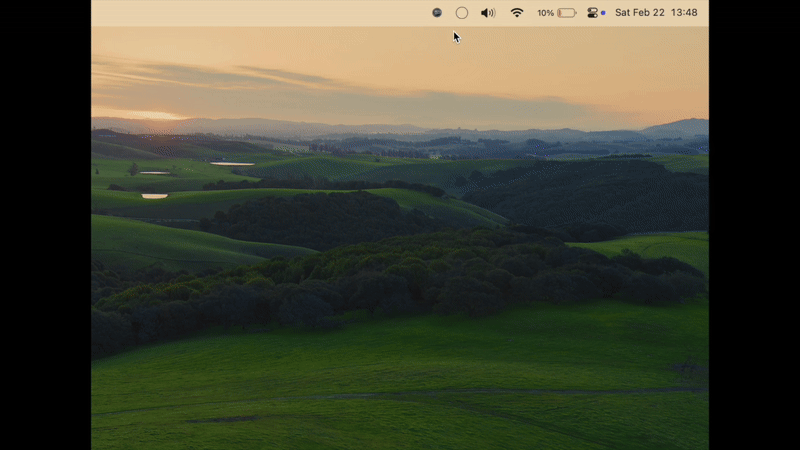

# RapidRoute 🚀

<div align="center">
  
  <p><em>Split-flap Departure Monitor in your menubar</em></p>
</div>

RapidRoute transforms your menubar into an elegant departure monitor starring a split-flap display, providing real-time public transport information right at your fingertips. Built with Tauri and powered by the [MobiData BW® API](https://www.mobidata-bw.de/blog/abfahrts-ankunfts-monitor), it delivers accurate departure times with native performance.

## ✨ Key Features

- **Live Departures** - Real-time departure information from [MobiData BW®](https://www.mobidata-bw.de/blog/abfahrts-ankunfts-monitor)
- **Smart Station Search** - Quickly find your nearest stations and stops
- **Favorite Routes** - Pin your most-used connections for instant access
- **Auto-Refresh** - Always up-to-date departure times
- **Clean Interface** - Beautifully designed timetable with clear visibility

## 🚀 Quick Start

```bash
# Install dependencies
pnpm install

# Launch development environment
pnpm tauri dev
```

## 🛠️ Tech Stack

- **Tauri** - Lightweight, secure native runtime
- **Vue.js** - Progressive JavaScript framework
- **Rust** - Systems programming for performance
- **Modern CSS** - Fluid animations and styling

## 🔮 Upcoming Features
- [ ] **UI Redesign** - Make the UI look better
- [ ] **Mobile version** - Use RapidRoute on your phone
- [ ] **Custom Shortcuts** - Create personalized keyboard combinations
- [ ] **Cloud Sync** - Backup and sync your settings across devices

## 🤝 Contributing

I welcome contributions! Whether it's bug fixes, feature additions, or documentation improvements:

1. Fork the repository
2. Create your feature branch
3. Commit your changes
4. Push to the branch
5. Open a Pull Request

## 📄 License

This project is licensed under the MIT License - see the [LICENSE](./LICENSE) file for details.

## 🙏 Acknowledgements

- Tauri Team for the incredible framework
- [Departure Board](https://github.com/paulcuth/departure-board) - For the inspiration on the beautiful split-flap display animation implementation
- [Tauri Menubar App](https://github.com/4gray/tauri-menubar-app) - For guidance on menubar app implementation and System Tray API usage

---

<div align="center">
  Made with ❤️ by Paul Müller
</div>
